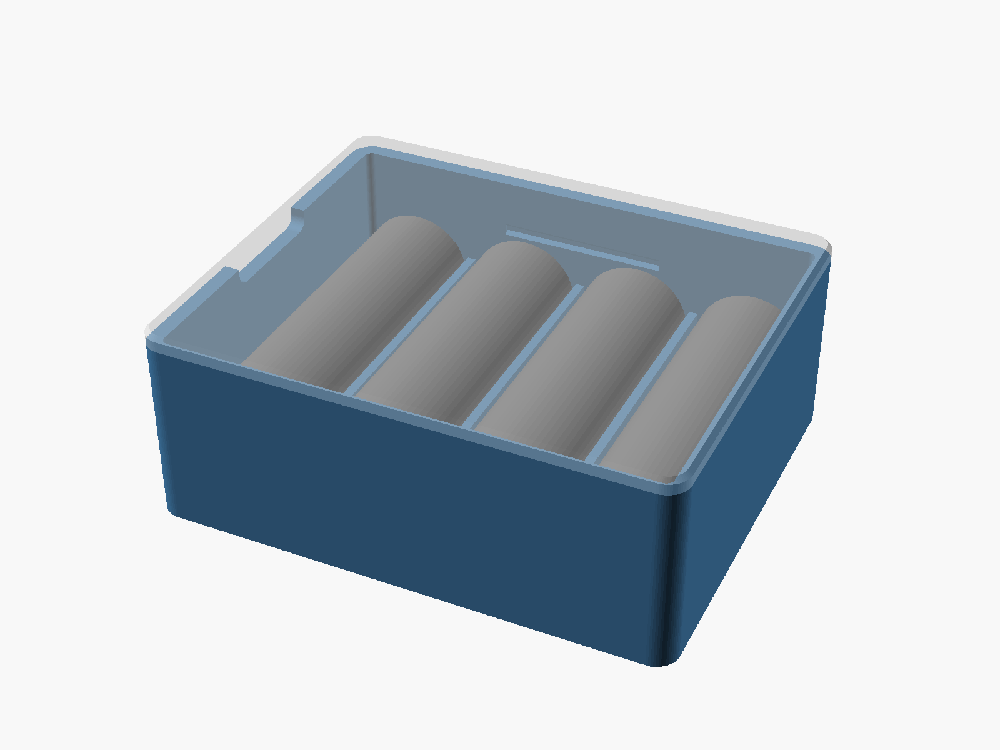

# Guía de Producción: Caja con tapa a presión para 4 pilas AA

Estuche de bolsillo para llevar 4 pilas AA de repuesto sin que se mezclen ni se toquen entre sí. Son
dos piezas impresas, sin tornillos ni imanes: una caja con un alojamiento por pila y una tapa que
encastra a presión con dos pestañas flexibles. Cerrada mide 67,2 × 54,9 × 26,9 mm. Se cierra con el
pulgar y se abre con la uña desde la muesca del borde.



> ⚠️ **Holguras por defecto, no medidas.** El encastre usa valores genéricos para FDM con boquilla
> de 0,4 mm (`perfil_medido = false` en `src/perfil_impresora.scad`). Si la tapa sale dura o floja,
> ajustar como indica la sección 3.

| Archivo | Uso |
|---------|-----|
| `exports/caja_pilas_caja.stl` y `exports/caja_pilas_tapa.stl` | Piezas listas para el laminador (valores por defecto) |
| `src/caja_pilas_parametros.scad` | Medidas compartidas: el único archivo que hay que editar para adaptar el diseño (sección 4) |
| `src/caja_pilas_caja.scad` y `src/caja_pilas_tapa.scad` | Una pieza por archivo |
| `src/caja_pilas_ensamblaje.scad` | Vista del conjunto con comprobaciones del encastre (no se imprime) |

## Primeros pasos

1. **Imprimir la tapa** (sección 1): es la pieza chica y la que lleva las pestañas.
2. **Imprimir la caja** (sección 1).
3. **Probar el encastre** sin pilas: cerrar y abrir la tapa un par de veces (sección 3).
4. **Cargar las pilas y cerrar** siguiendo los pasos de la sección 2.

## 1. Especificaciones de Impresión 3D

| Pieza | STL | Cant. | Orientación (cara sobre la cama) | Relleno | Perímetros | Soportes | Adherencia |
|-------|-----|-------|----------------------------------|---------|------------|----------|------------|
| Caja | `caja_pilas_caja.stl` | 1 | Base (abertura hacia arriba), tal como viene el STL | 20 % rejilla | 3 | No | Ninguna |
| Tapa | `caja_pilas_tapa.stl` | 1 | Cara exterior (pollera hacia arriba), tal como viene el STL | 20 % rejilla | 3 | No | Ninguna |

**Configuración común del laminador**: capa de 0,2 mm, ancho de línea de 0,4–0,45 mm, 4 capas
superiores y 4 inferiores. Con 2 mm de pared y 1,2 mm de pollera las piezas salen prácticamente
macizas: el relleno solo afecta a una parte mínima. No hace falta borde (*brim*): los bordes de las dos
caras sobre la cama tienen un chaflán de 0,6 mm que absorbe la "pata de elefante".

**Material recomendado**: **PETG** (boquilla 230–245 °C, cama 70–80 °C). Las pestañas se doblan
1,38 % al cerrar, por debajo del 1,5 % que el PETG admite en uso repetido. El **PLA** es más rígido y
admite ≈ 1 %: si se imprime en PLA, bajar `saliente_reborde` a 0,35 mm antes de exportar
(sección 4).

## 2. Ensamblaje y Lista de Materiales (BOM)

### Herrajes / Tornillería Requerida

<!-- BOM:inicio (generado desde docs/caja_pilas_bom.csv con scripts/generar_web.py: no editar a mano) -->
**Filamento**

* 40 g de filamento PETG de 1,75 mm (caja ≈ 25 g y tapa ≈ 12 g)
<!-- BOM:fin -->

No lleva tornillería ni componentes comprados: las 4 pilas AA son lo que se guarda.

### Herramientas

* Ninguna. Si en las ranuras de las pestañas queda un hilo de plástico, cortarlo con un cúter.

### Instrucciones Paso a Paso

1. **Colocar las pilas.** Apoyar la caja con la abertura hacia arriba y bajar una pila AA en cada
   alojamiento, acostada y desde arriba. Entran por su peso; si una no entra, ver la sección 3.
2. **Cerrar la tapa.** Apoyar la tapa con la pollera hacia abajo sobre la boca de la caja (entra en
   cualquiera de sus dos orientaciones) y empujarla desde arriba con el pulgar, en el centro, hasta
   sentir el "clic" de las dos pestañas. La tapa queda al ras del borde.
3. **Abrir la caja.** Meter la uña en la muesca de la pared corta, debajo del borde de la tapa, y
   levantar. Para vaciarla, dar vuelta la caja abierta sobre la mano: las pilas caen solas.

## 3. Puesta a punto

Probar el encastre con la caja vacía, cerrando y abriendo la tapa.

| Síntoma | Causa probable | Qué hacer |
|---------|----------------|-----------|
| La tapa cierra muy dura o una pestaña se marca de blanco | Reborde demasiado alto para esta impresora o material más rígido | Bajar `saliente_reborde` en 0,05 mm y regenerar **los dos** STL |
| La tapa no hace "clic" o se abre sola al sacudir | Reborde bajo o impresora que "adelgaza" las piezas | Subir `saliente_reborde` en 0,05 mm (hasta 0,55 mm en PETG) y regenerar los dos STL |
| La pollera no entra o roza todo el contorno | La impresora "engorda" las piezas | Medir la impresora con el peine de calibración y cargar los valores en `src/perfil_impresora.scad` (skill `pieza-openscad`, `calibracion.md`) |
| Una pila no entra en su alojamiento | Pila fuera de norma o caja que "engorda" | Medir la pila y subir `diametro_pila` o `largo_pila` |

`saliente_reborde` cambia el reborde de la tapa **y** la ranura de la caja, por eso hay que
reimprimir las dos piezas. El generador rechaza los valores que harían doblar la pestaña más de 1,5 %.

**Prueba de aceptación**: con las 4 pilas y la tapa cerrada, sacudir la caja con fuerza: la tapa no se
abre y ninguna pila pasa al alojamiento de al lado.

## 4. Adaptación a tus componentes

Editar `src/caja_pilas_parametros.scad` (o usar el Customizer de OpenSCAD) y regenerar **los dos**
STL con los mismos valores:

```bash
.tools/bin/openscad -o exports/caja_pilas_caja.stl src/caja_pilas_caja.scad
```

```bash
.tools/bin/openscad -o exports/caja_pilas_tapa.stl src/caja_pilas_tapa.scad
```

| Parámetro | Por defecto | Rango | Para qué |
|-----------|-------------|-------|----------|
| `cantidad_pilas` | 4 | 1 – 10 | Otra cantidad de pilas en la fila (6 pilas: 99,4 mm de largo) |
| `diametro_pila`, `largo_pila` | 14,5 / 50,5 mm | 8 – 20 / 30 – 70 mm | Otro tamaño: AAA = 10,5 / 44,5 mm |
| `espesor_pared`, `espesor_piso` | 2,0 / 2,0 mm | 1,6 – 4 / 1,2 – 4 mm | Una caja más robusta |
| `saliente_reborde` | 0,5 mm | 0,3 – 0,8 mm | Dureza del encastre (sección 3) |
| `alto_tabique` | 10 mm | 4 – 20 mm | Tiene que superar el juego vertical de la pila (8,4 mm por defecto) |

Si una combinación es imposible, OpenSCAD se detiene con un mensaje que nombra el parámetro y su
límite: pared demasiado fina para la ranura, pestaña que se doblaría de más, tabique que la pila
podría saltar o caja que no entra en la cama.

## 5. Seguridad

Los tabiques separan las pilas, así que sus bornes no se tocan entre sí. La caja no es estanca: no
guardar pilas hinchadas, golpeadas o con pérdidas.

## 6. Consejos y buenas prácticas

- **Imprimir en PETG.** Las pestañas trabajan cerca del límite del PLA; en PLA, bajar
  `saliente_reborde` a 0,35 mm (sección 1).
- **Imprimir la tapa primero y probar el encastre vacío.** Así se ajusta `saliente_reborde` antes de
  cargar pilas (Primeros pasos y sección 3).
- **Regenerar siempre las dos piezas juntas.** La ranura de la caja y el reborde de la tapa salen del
  mismo parámetro (secciones 3 y 4).
- **Cerrar empujando en el centro de la tapa.** Las dos pestañas están en el centro de los lados
  largos y enganchan a la vez (sección 2, paso 2).
- **Vaciar dando vuelta la caja.** Es más rápido que sacar las pilas de a una (sección 2, paso 3).
