# Guía de Producción: Puntero láser estelar motorizado

Montura motorizada de dos ejes (altitud-azimut) que apunta un puntero láser verde "303" a cualquier
estrella del cielo. Se enrosca al tornillo 3/8"-16 de un trípode de telescopio. Un ESP32 mueve dos
motores 28BYJ-48 a través de correas GT2 con reducción 1:4 y enciende el láser con un relé. La
mecánica está pensada para un error de apuntado menor a 2°: el presupuesto estimado es de 0,5° (suma
cuadrática) y 1,35° en el peor caso.

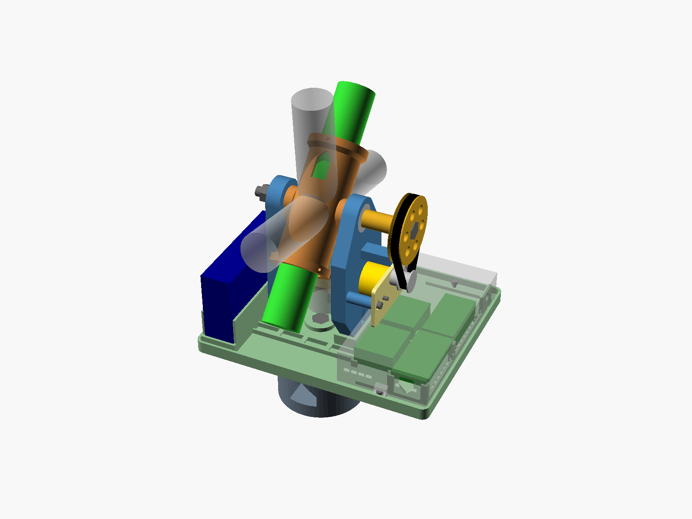

```text
                    polea de altura 80T (por fuera del brazo)
                         │      cuna con el láser (gira en altura, −10° … 95°)
                         ▼     ┌──────────────────────────┐
      brazo "cable" ║════════[cuna]════════║ brazo "motor" ◄── motor de altura + carro (pilares)
                    ║                      ║          │ correa GT2 200 mm
   ─X  power bank ┌─╨──────────────────────╨─┐ tapa: ESP32, relé, 2 × ULN2003,  +X
       (de pie)   │      plataforma de azimut │ interruptor y sobrante de cable
                  └────────────┬─────────────┘
          motor de azimut (+Y) │ perno M8, 2 × 608ZZ
                  ┌────────────┴─────────────┐
                  │  base + polea fija 80T    │  ◄── correa GT2 200 mm (bajo la plataforma)
                  └────────────┬─────────────┘
                       tuerca 3/8"-16 ── trípode
```

| Archivo | Uso |
|---------|-----|
| `exports/puntero_laser_*.stl` (10 archivos) | Piezas listas para el laminador (valores por defecto) |
| `src/puntero_laser_parametros.scad` | Medidas compartidas: el único archivo que hay que editar para adaptar el diseño (sección 4) |
| `src/puntero_laser_<pieza>.scad` | Una pieza por archivo |
| `src/puntero_laser_ensamblaje.scad` | Vista del conjunto con comprobaciones de choque (no se imprime) |

### Valores del diseño entregado

| Parámetro | Valor | Parámetro | Valor |
|-----------|-------|-----------|-------|
| `diametro_laser` | 30 mm | `largo_laser` | 190 mm |
| `distancia_trasera_centro_masa` | 95 mm | `masa_laser_g` | 180 g |
| `powerbank_largo × _ancho × _alto` | 100 × 65 × 25 mm | `esp32_largo × _ancho` | 55 × 28 mm |
| `rele_largo × _ancho` | 50 × 26 mm | `uln2003_largo × _ancho` | 35 × 32 mm |
| `dientes_polea_conducida` | 80 | `largo_correa` | 200 mm |
| `espesor_brazo` | 12 mm | `ajuste_608` | +0,10 mm |
| `holgura_encastre` | 0,25 mm | `holgura_colimacion` | 2 mm por lado |

Cotas que resultan (las imprime `src/puntero_laser_parametros.scad` con `echo`):

| Cota | Valor |
|------|-------|
| Distancia entre los centros de las poleas | 45,97 mm |
| Altura del eje de altura sobre la plataforma | 109,3 mm (179,8 mm sobre el trípode) |
| Plataforma | 194,3 × 165,9 mm |
| Centro de masa de la parte giratoria | a ≈ 4 mm del eje |
| Masa total estimada del aparato | ≈ 975 g |

## Primeros pasos

1. **Medir tus componentes** antes de imprimir nada: diámetro, largo y punto de equilibrio del láser,
   y medidas del power bank y de las placas (sección 4.1). Si difieren de los valores del diseño
   entregado, cargarlos en `src/puntero_laser_parametros.scad` y regenerar los STL (sección 4.3).
2. **Imprimir la probeta del 608** y calibrar `ajuste_608` (sección 3.1). Si el valor cambia,
   regenerar los 10 STL.
3. **Imprimir el resto de las piezas** en PETG (sección 1).
4. **Comprar los componentes** de la lista de materiales (sección 2). Con el relé, fijarse que sea
   compatible con 3,3 V (sección 5.4).
5. **Armar** siguiendo los pasos de la sección 2 y hacer la **puesta a punto** (sección 3).

## 1. Especificaciones de Impresión 3D

> **Holguras por defecto, no medidas.** Este proyecto todavía no tiene un perfil de impresora medido
> (`src/perfil_impresora.scad`). Los encajes de este diseño usan valores genéricos para FDM con
> boquilla de 0,4 mm:
>
> - encastres de 0,25 mm;
> - paso de M3 de 0,3 mm;
> - alojamientos de tuerca de 0,2 mm;
> - paso de M8 de 0,4 mm;
> - 608 a presión con +0,10 mm.
>
> Los más críticos son los alojamientos de los 608: calibrarlos con la probeta (3.1) antes de
> imprimir el resto.

**Orden de impresión**: imprimir **primero la probeta de ajuste del 608** (sección 3.1). Si el valor
de `ajuste_608` cambia, hay que **regenerar los 10 STL** antes de imprimir el resto.

| Pieza | STL | Cant. | Orientación (cara sobre la cama) | Relleno | Perímetros | Soportes | Adherencia | Masa maciza* |
|-------|-----|-------|----------------------------------|---------|------------|----------|------------|--------------|
| Probeta de ajuste del 608 | `puntero_laser_probeta_ajuste_608.stl` | 1 | Plana, tal como viene | 15 % | 3 | No | — | 13 g |
| Adaptador del trípode (base) | `puntero_laser_adaptador_tripode.stl` | 1 | Cara de apoyo del trípode | 40 % giroide | 4 | No | — | 254 g |
| Plataforma de azimut | `puntero_laser_plataforma_azimut.stl` | 1 | Cara inferior | 20 % giroide | 3 | No | Borde (brim) de 5 mm si la cama despega esquinas | 212 g |
| Brazo de la horquilla, motor | `puntero_laser_brazo_horquilla_motor.stl` | 1 | Cara interior (pilares hacia arriba) | 30 % | 4 | No | — | 101 g |
| Brazo de la horquilla, cable | `puntero_laser_brazo_horquilla_cable.stl` | 1 | Cara interior (canal hacia arriba) | 30 % | 4 | No | — | 57 g |
| Cuna del láser | `puntero_laser_cuna_laser.stl` | 1 | De pie, sobre un anillo de colimación | 30 % | 4 | No | Borde (brim) de 5 mm | 55 g |
| Polea de altura | `puntero_laser_polea_altitud.stl` | 1 | Cara exterior (cubo hacia arriba) | 40 % | 4; capa de 0,16 mm | No | — | 23 g |
| Carro del motor | `puntero_laser_carro_motor.stl` | **2** | Plano | 40 % | 4 | No | — | 8 g c/u |
| Separador y 3 arandelas | `puntero_laser_separador_azimut.stl` | 1 | De pie, tal como viene | 100 % | — | No | — | 1 g |
| Tapa de la electrónica | `puntero_laser_tapa_electronica.stl` | 1 | Techo | 15 % | 3 | No | — | 54 g |

\* Masa si la pieza fuera maciza de PETG. Con los ajustes de la tabla, el conjunto impreso pesa
≈ 420 g; el laminador da el valor exacto.

| | | |
|---|---|---|
| 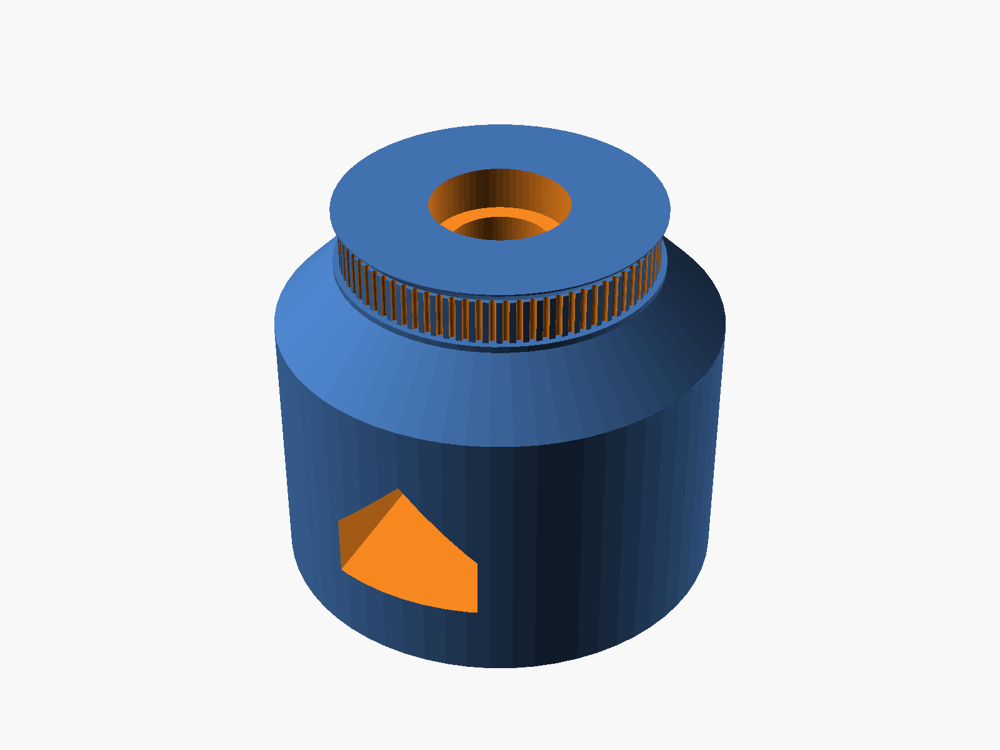 Base | 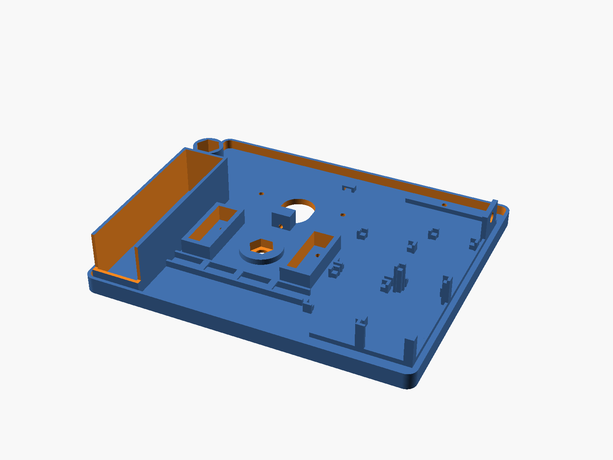 Plataforma | 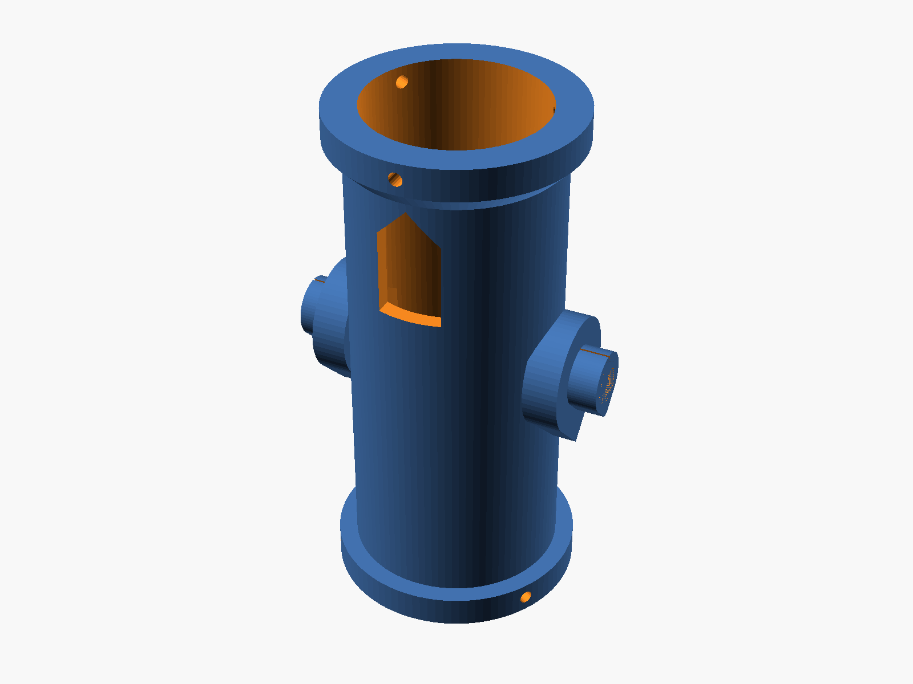 Cuna |
| 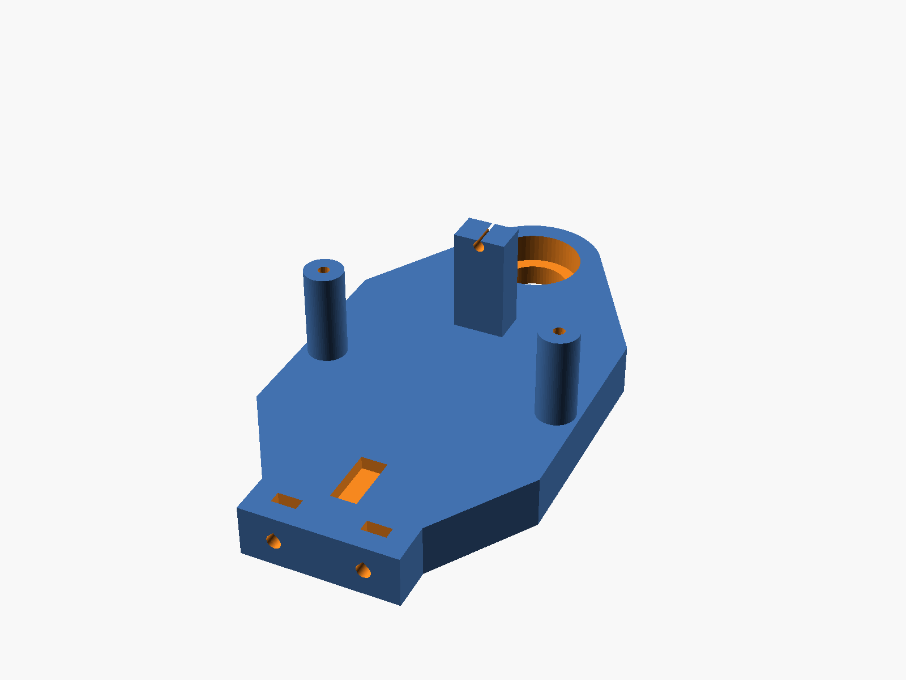 Brazo motor | 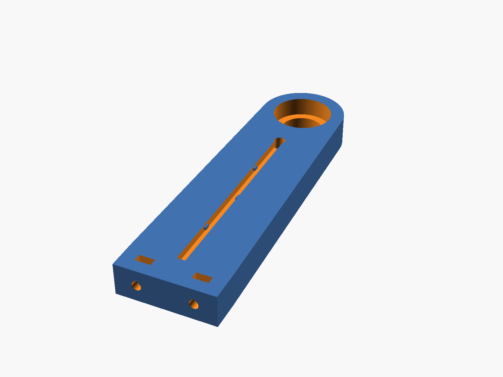 Brazo cable | 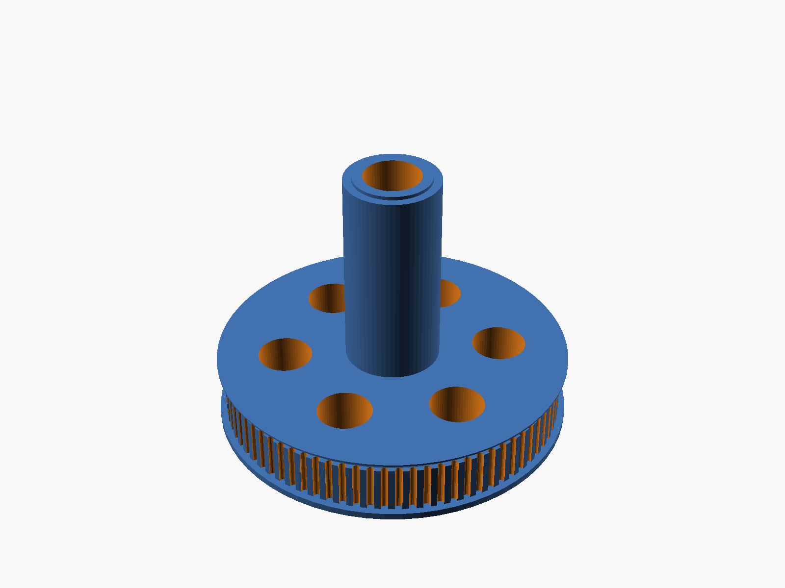 Polea de altura |
| 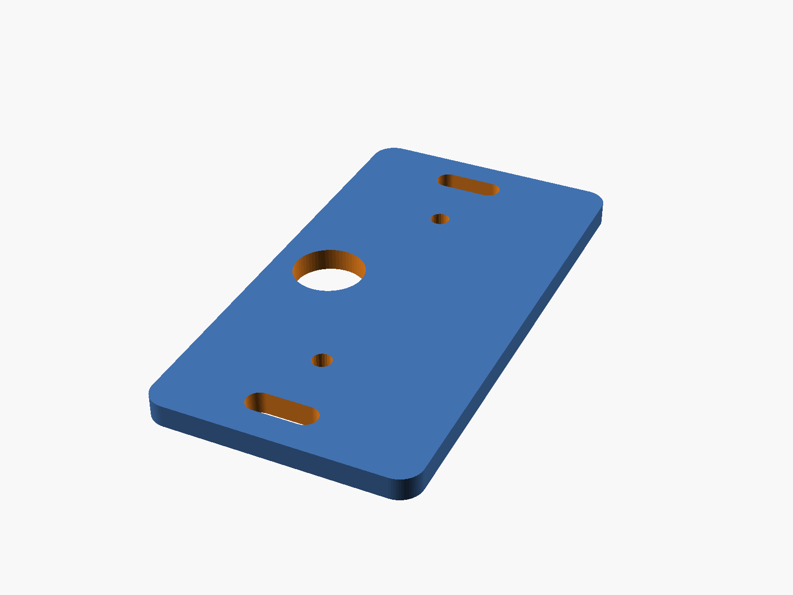 Carro (×2) | 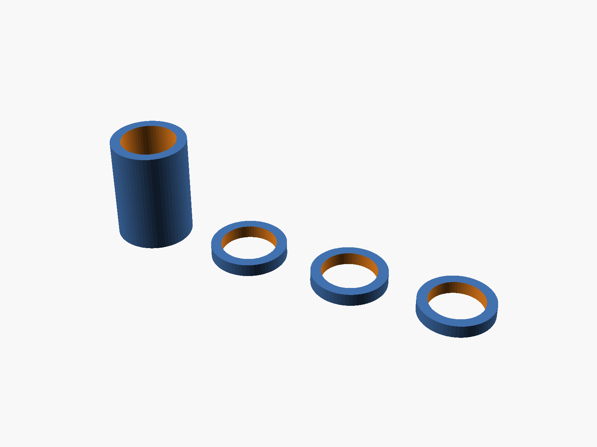 Separador y arandelas | 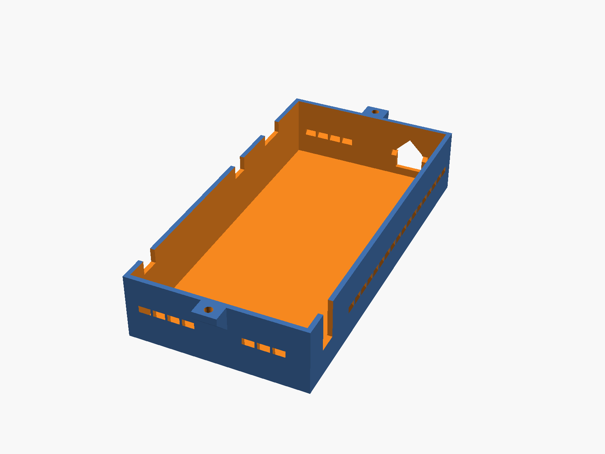 Tapa |
| 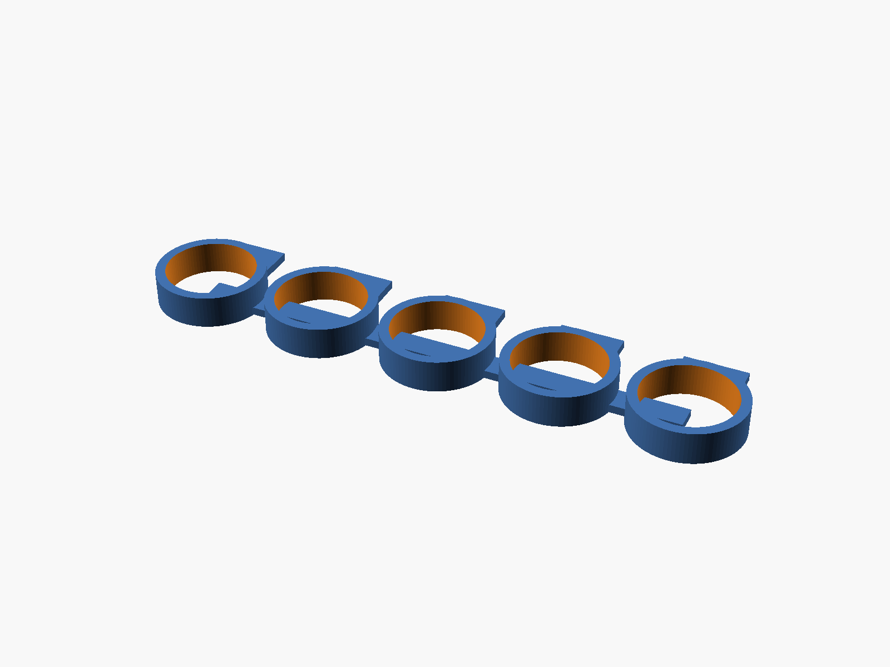 Probeta del 608 | | |

**Ninguna pieza necesita soportes.** Los únicos voladizos son puentes cortos: los techos de las
tuercas embebidas, las ranuras de la cuna, las ventanas con techo a dos aguas (ningún puente supera 10 mm), y la repisa anular de 3 mm sobre el
alojamiento del 608 inferior de la base. Los muñones de la cuna, la ventana de la base y las pestañas
de las poleas tienen perfiles a 45°.

**Configuración común del laminador**:

- Capa de 0,2 mm (0,16 mm en las poleas, para que los dientes GT2 salgan definidos).
- 5 capas superiores e inferiores.
- Sin "alisado" (ironing) en las caras de apoyo de los rodamientos.

**Material recomendado: PETG**, con boquilla a 230–245 °C y cama a 70–85 °C. Resiste la humedad
nocturna y la temperatura dentro de un auto al sol. El PLA sirve para pruebas, pero se ablanda a
~55 °C.

## 2. Ensamblaje y Lista de Materiales (BOM)

### Herrajes / Tornillería Requerida

<!-- BOM:inicio (generado desde docs/puntero_laser_bom.csv con scripts/generar_web.py: no editar a mano) -->
**Rodamientos, poleas y correas**

* 4 × Rodamiento 608ZZ (22 × 8 × 7 mm)
* 2 × Polea GT2 20 dientes, agujero de 5 mm, para correa de 6 mm (con 2 prisioneros)
* 2 × Correa GT2 cerrada de 200 mm × 6 mm (100 dientes)

**Pernos y tuercas M8 y del trípode**

* 1 × Perno M8 × 50 mm cabeza hexagonal (eje de azimut)
* 1 × Perno M8 × 55 mm cabeza hexagonal (eje de altura, lado del motor: entra desde afuera por la polea)
* 1 × Perno M8 × 30 mm cabeza hexagonal (eje de altura, lado del cable)
* 2 × Tuerca autoblocante M8
* 1 × Tuerca M8 común de 6,5 mm de alto (DIN 934), para el muñón +X de la cuna
* 1 × Tuerca 3/8"-16 UNC (tornillo del trípode)
* 2–4 × Arandela M8 fina (solo si hace falta ajustar la horquilla a la plataforma, paso 8)
* 4 × Tuerca M8 extra como contrapeso (opcional, sección 3.4)

**Tornillería M3**

* 4 × Tornillo M3 × 12 mm + 4 × tuerca M3: pies de los brazos
* 2 × Tornillo M3 × 10 mm + 2 × tuerca M3: carro de azimut
* 2 × Tornillo M3 × 12 mm: carro de altura, autorroscante en los pilares
* 4 × Tornillo M3 × 8 mm + 4 × arandela M3: orejas de los motores, autorroscante en el carro
* 2 × Tornillo M3 × 16 mm: tensores, autorroscante en los topes
* 6 × Prisionero M3 × 8 mm (DIN 916, punta plana): colimación del láser
* 1 × Tornillo M3 × 12 mm para roscar previamente los agujeros de los prisioneros (se retira)
* 2 × Tornillo M3 × 10 mm + 2 × tuerca M3: tapa

**Electrónica**

* 1 × ESP32 DevKit (30 o 38 pines)
* 2 × Motor paso a paso 28BYJ-48 de 5 V con su placa driver ULN2003
* 1 × Módulo relé de 1 canal **compatible con lógica de 3,3 V**: disparo por nivel alto, o con puente "H/L" en H
* 1 × Puntero láser verde "303" con su batería
* 1 × Power bank USB de 5 V y ≥ 2 A
* 1 × Interruptor de palanca miniatura con rosca M6 (tipo MTS-102)
* 1 × Cable USB-A con salida a bornes (o cable USB cortado)
* 40 cm de cable de silicona de 2 × 26 AWG (relé → láser)
* Cables Dupont hembra-hembra
* Bridas de 3 mm
* Una banda elástica o una tira de velcro para el power bank
<!-- BOM:fin -->

### Instrucciones Paso a Paso

Antes de empezar, retirar los restos de impresión de todos los alojamientos y probar el ajuste de los
608 (sección 3.1).

1. **Base: tuerca del trípode.** Dejar caer la tuerca 3/8"-16 por arriba de la base hasta su
   alojamiento hexagonal del fondo. El tornillo del trípode la tira contra el piso.
2. **Base: rodamientos de azimut.** Prensar un 608ZZ desde arriba en el alojamiento superior. Meter
   el segundo 608 por la ventana lateral y prensarlo hacia arriba en el alojamiento inferior: se puede
   tirar de él con el perno M8 × 50, arandelas y una tuerca. Los dos quedan apoyados contra el resalte
   central.
3. **Cuna: perno del lado del cable.** Antes de colocar el láser, meter el perno M8 × 30 desde
   **dentro del tubo**, con la punta primero, por el muñón −X (el que está junto a la ranura del cable),
   hasta que la cabeza entre en su hexágono. El perno queda apuntando hacia afuera.
4. **Brazos: rodamientos.** Prensar un 608ZZ en cada brazo desde la cara exterior, hasta que quede
   enrasado y apoyado en el labio interior.
5. **Cuna entre los brazos.** La horquilla se arma con los brazos **sueltos**: atornillados a la
   plataforma quedan a 50 mm, y la cuna con sus anillos de contacto mide 60 mm. Calzar el **brazo
   cable** sobre el perno M8 × 30 hasta que el anillo de contacto del muñón −X apoye en el aro interior
   del 608. Del otro lado, calzar el **brazo motor** sobre el anillo del muñón +X. Las caras interiores
   de los brazos miran hacia la cuna.
6. **Lado del cable.** Poner una arandela de contacto impresa y una tuerca autoblocante M8 en el perno
   M8 × 30. Apretar sin frenar el giro.
7. **Polea de altura.** Meter la tuerca M8 común por un extremo del tubo y encajarla en el hexágono del
   muñón +X; sostenerla con un dedo. Pasar el perno M8 × 55 por la polea 80T desde la cara exterior,
   con la cabeza en el hexágono, y llevarlo con el cubo de la polea hacia el brazo motor: atraviesa el
   608 y el muñón y llega a la tuerca. Enroscarlo **girando la polea** mientras se sostiene la cuna,
   hasta que apriete; no hace falta llave. La cabeza hace de chaveta: la polea, el perno y la cuna
   giran juntos. La punta queda 0,5 mm antes del interior del tubo y no toca el láser.
8. **Horquilla a la plataforma.** Colocar una tuerca M3 en cada ranura del pie de los brazos,
   entrándola por la cara exterior del brazo. Bajar la horquilla armada (brazos, cuna y polea) a los
   marcos de la plataforma: el **brazo motor** en +X (lado de la tapa) y el **brazo cable** en −X (lado
   del power bank). Fijar cada brazo con 2 × M3 × 12 desde abajo de la plataforma. Si para que los pies
   entren en los marcos hay que separar los brazos, la cuna queda corta: retirar el brazo cable, poner
   arandelas M8 finas en el perno entre el muñón y el 608, y volver a armar ese lado.
9. **Motores a los carros.** Atornillar cada 28BYJ-48 a un carro con 2 × M3 × 8 y arandela,
   autorroscantes en los agujeros de las orejas. El cuerpo del motor queda hacia +X del carro, del
   lado contrario al agujero del eje.
10. **Motor de azimut.** Colocar las 2 tuercas M3 en los hexágonos de la cara inferior de la
    plataforma, bajo el asiento del carro (+Y). Apoyar el carro con el motor encima y el eje hacia
    abajo, a través de la abertura alargada, con la cara del tensor hacia el tope. Fijarlo con
    2 × M3 × 10 sin apretar. Desde abajo, calzar la polea 20T en el eje, con el cubo hacia arriba metido
    en la abertura, y apretar sus prisioneros sobre la cara plana del eje.
11. **Plataforma sobre la base.** Colocar una arandela de contacto impresa sobre el aro interior del 608
    superior. Con la cuna horizontal, meter el perno M8 × 50 entre los brazos, por debajo de la cuna, y
    pasarlo por el cubo central: la cabeza queda en el hexágono, enrasada. Sosteniéndolo, bajar la
    plataforma sobre la base. Antes de que el perno salga por el 608 inferior, poner el **separador**
    entre los dos rodamientos. Por la ventana lateral, poner la segunda arandela de contacto y la
    tuerca autoblocante M8, y apretar con una llave de 13 mm hasta que **desaparezca el juego** y la
    plataforma gire suave, sin frenarse.
12. **Correa de azimut.** Pasar la correa de 200 mm alrededor de la polea fija de la base y de la polea
    20T. Tensar con el tornillo M3 × 16 del tope (sección 3.2) y apretar los 2 M3 del carro.
13. **Motor de altura.** Atornillar el carro con su motor sobre los 2 pilares del brazo motor con
    2 × M3 × 12 autorroscantes, sin apretar. El motor queda entre el carro y el brazo, con el eje hacia
    afuera. Calzar la polea 20T (cubo hacia el carro), pasar la correa, tensar con el tornillo del tope
    y apretar.
14. **Láser.** Pasar el láser por la cuna con el cabezal hacia +Y (adelante). Si el cabezal es más
    ancho que el tubo, entrarlo por atrás. Antes, soldar los 2 hilos de silicona en paralelo al
    pulsador del láser y dejar la llave en ON. Sacar los hilos por la ranura junto al muñón −X,
    pasarlos por el agujero del brazo cable dejando un **bucle de 40 mm** y bajarlos por el canal de la
    cara exterior del brazo.
15. **Electrónica.** Encajar las placas en sus soportes (lado +X): los 2 ULN2003 y el relé apoyados,
    y el ESP32 elevado, con los pines hacia abajo. Atornillar el interruptor en su soporte, con la
    palanca hacia +X. Colocar el power bank de pie en su bolsillo (−X), con el conector USB hacia el
    extremo bajo de la pared (−Y), y sujetarlo con la banda elástica alrededor del bolsillo.
16. **Cableado.** Conectar según la sección 5.4:
    - El cable de alimentación y los hilos del láser cruzan por el **conducto elevado** (Y = −30 mm).
    - El cable del motor de altura baja por el canal de la cara exterior del brazo motor.
    - El cable del motor de azimut se fija con una brida al puente de la plataforma y entra a la tapa
      por la pared −X.
    - El sobrante se enrolla en el hueco del extremo +Y, bajo la tapa.
    - Ningún cable debe tocar correas ni poleas.
17. **Tapa.** Bajar la tapa sobre el reborde de la plataforma (la palanca del interruptor entra por la
    ranura) y fijarla con 2 × M3 × 10 y tuerca en sus orejas.
18. **Puesta a punto.** Equilibrar y colimar el láser (secciones 3.3 y 3.5).

### Montaje en el trípode

Enroscar la base a mano sobre el tornillo 3/8"-16 de la cabeza del trípode hasta que apoye firme;
no hacen falta herramientas y se hace en menos de 1 minuto. Nivelar el trípode a ojo (±2°): la
alineación con 2 estrellas corrige el resto (sección 5.3).

## 3. Puesta a punto mecánica para la precisión

### 3.1 Calibración del ajuste del 608

La probeta tiene 5 anillos de 22 mm + ajuste. El anillo con **1 punto** es −0,1 mm y el de **5 puntos**
es +0,3 mm, en pasos de 0,1 mm.

1. Probar un 608ZZ en cada anillo.
2. Elegir el que entra con **presión firme a mano** (o con una prensa suave) y no tiene juego.
3. Poner ese valor en `ajuste_608` dentro de `src/puntero_laser_parametros.scad` y regenerar los 10
   STL (sección 4.3).

| Anillo (puntos) | 1 | 2 | 3 | 4 | 5 |
|-----------------|---|---|---|---|---|
| `ajuste_608` | −0,1 | 0 | +0,1 (por defecto) | +0,2 | +0,3 |

Un 608 flojo en la base inclina la plataforma con un error que **cambia con el azimut** y que la
alineación no corrige. Es el ajuste más importante del aparato.

### 3.2 Tensado de las correas

Aflojar los 2 M3 del carro, girar el tornillo del tope hasta que la correa ceda **≈ 2 mm** al
presionarla con un dedo en el centro del tramo, y volver a apretar los M3. Una correa floja agrega
juego; una muy tensa frena el motor. El carro tiene ±3 mm de recorrido.

### 3.3 Equilibrado del láser

Con los motores **sin energía**, deslizar el láser dentro de la cuna (con los prisioneros flojos)
hasta que quede **quieto a 0°, 45° y 90°**. Entonces fijarlo con los 6 prisioneros. Con el láser
equilibrado, el motor trabaja descansado y su caja sostiene la posición sin energía: la deriva debe
ser ≤ 0,2° en 5 minutos.

**Par del eje de altura (FR-024)**:

| Situación | Par necesario | Par disponible (34 mN·m × 4 × 0,9) | Factor de seguridad |
|-----------|---------------|------------------------------------|---------------------|
| Láser equilibrado (desbalance ≤ 10 mm) | 23,5 mN·m | 122,4 mN·m | 5,2 |
| Láser sin equilibrar (desbalance de 20 mm) | 47,1 mN·m | 122,4 mN·m | 2,6, sin margen con frío |

### 3.4 Contrapeso (opcional)

El centro de masa de la parte giratoria queda a ≈ 4 mm del eje. Si un power bank más pesado lo
desplaza, se pueden apilar hasta 4 tuercas M8 en el alojamiento del contrapeso (esquina −X, +Y).

### 3.5 Colimación del haz

1. Roscar los 6 agujeros de los anillos pasando primero un tornillo M3 × 12, y después colocar los
   prisioneros M3 × 8.
2. Apuntar el aparato a una pared a **10 m**.
3. Girar el láser sobre su propio eje dentro de la cuna, con los prisioneros flojos: el punto describe
   un círculo.
4. Ajustar los prisioneros de los dos anillos hasta que el círculo mida **≤ 44 mm** de diámetro
   (≤ 0,25°).

El rango de corrección es de ±1,2° (±2 mm en 94 mm).

### 3.6 Presupuesto de error

| Fuente | Valor estimado | Cómo se controla |
|--------|----------------|------------------|
| Resolución (cada eje) | 0,022° | Correa 1:4: 45,29 pasos/° |
| Repetibilidad de la caja del motor (cada eje) | 0,1° | Llegada siempre desde el mismo sentido (sección 5.2) |
| Correa y dientes impresos (cada eje) | 0,1° | Tensado (3.2) |
| Inclinación de la plataforma | ≤ 0,1° | 608 a presión (3.1), separados 30 mm y precargados |
| Perpendicularidad entre ejes | ≤ 0,25° | Brazos en marcos; la alineación lo absorbe en parte |
| Colimación residual | ≤ 0,2° | Sección 3.5 |
| Centrado de las estrellas de alineación | 0,3° | Sección 5.3 |
| Flexión de los brazos y hora | 0,06° | Brazos de 12 mm; hora por NTP |
| **Total** | **0,50° (suma cuadrática); 1,35° (peor caso)** | Límite de 2° (objetivo 1°) |

**Cuándo repetir el cálculo estructural**: si el láser pesa más de 400 g (`masa_laser_g > 400`) o el
brazo supera los 160 mm (`alto_brazo > 160`). Ver la justificación en
`specs/002-puntero-laser-estelar/plan.md`.

## 4. Adaptación a tus componentes

### 4.1 Qué medir

| Componente | Qué medir | Parámetro |
|------------|-----------|-----------|
| Láser | Diámetro del **cuerpo** (no del cabezal) | `diametro_laser` |
| Láser | Largo total con la tapa trasera | `largo_laser` |
| Láser | **Punto de equilibrio**: apoyarlo con su batería sobre un borde hasta que no caiga, y medir desde el extremo trasero | `distancia_trasera_centro_masa` |
| Láser | Masa con su batería | `masa_laser_g` |
| Power bank | Largo, ancho (queda vertical) y espesor | `powerbank_largo`, `_ancho`, `_alto` |
| ESP32, relé, ULN2003 | Largo y ancho de cada placa | `esp32_*`, `rele_*`, `uln2003_*` |

### 4.2 Cómo cambiar los parámetros

- **Con interfaz gráfica**: abrir `src/puntero_laser_parametros.scad` en OpenSCAD, cambiar los valores
  y guardar. Todas las piezas toman los valores de ese archivo.
- **Por línea de comandos**: pasar **los mismos** `-D` a todas las piezas:

  ```bash
  .tools/bin/openscad --hardwarnings -D diametro_laser=26 -D largo_laser=240 -o exports/puntero_laser_cuna_laser.stl src/puntero_laser_cuna_laser.scad
  ```

- Para revisar el conjunto, renderizar `src/puntero_laser_ensamblaje.scad`. Si algo choca, la
  generación se detiene con un mensaje.

### 4.3 Regenerar todo

Después de **cualquier** cambio, regenerar los **10 STL**, no solo el de la pieza tocada. Los comandos
están en `specs/002-puntero-laser-estelar/quickstart.md`, escenario 2.

### 4.4 Mensajes de error de la validación

| Regla | Mensaje (empieza por) | Qué significa | Cómo corregirlo |
|-------|-----------------------|---------------|-----------------|
| V-01 | `<parámetro>=<valor>: fuera de rango` | Valor fuera de su rango admitido | Usar un valor dentro del rango indicado |
| V-02 | `distancia_trasera_centro_masa=` | El punto de equilibrio no está entre el 40 % y el 60 % del largo | Repetir la medición del punto de equilibrio |
| V-03 | `powerbank_alto=` | La plataforma supera 196 mm | Componentes más chicos o `largo_correa` más corto |
| V-04 | `largo_laser=` | El brazo supera 196 mm | Láser más corto, o equilibrarlo más cerca del medio |
| V-05, V-06 | `largo_correa=` | Correa corta: el tope tensor o las poleas no entran | Correa más larga (de 200 a 240 mm) |
| V-07 | `holgura_barrido=` | El láser toca algo en algún ángulo entre −10° y 95° | Subir `holgura_barrido` |
| V-08 | `<componente>_ancho` o `altura_placas=` | Componentes solapados o la tapa choca | Reducir medidas o cambiar el componente |
| V-10 | `espesor_plataforma=` | El eje del motor entra < 5 mm en la polea 20T | Reducir `espesor_plataforma` |
| V-11 | `<parámetro>=…: <pared> = … mm` | Una pared queda < 1,2 mm, o el brazo no aloja el 608 | Ajustar el parámetro nombrado |
| V-12 | `holgura_colimacion=` | La corrección del haz es < 1° | Aumentar `holgura_colimacion` o `largo_tubo_cuna` |
| V-13 | `powerbank_largo=` | Centro de masa a más de 20 mm del eje | Usar el contrapeso (3.4) o cambiar el power bank |
| V-14 | `separacion_608_azimut=` | Rodamientos de azimut muy juntos | Usar `separacion_608_azimut` ≥ 6 |
| Base | `diametro_apoyo_tripode=` | La base toca la polea 20T o su cono baja hasta la cámara | Reducir `diametro_apoyo_tripode` |

## 5. Electrónica y requisitos del firmware

El firmware del ESP32 no forma parte de este diseño. Para que la mecánica dé la precisión prometida,
**debe** cumplir lo siguiente (copia de `specs/002-puntero-laser-estelar/contracts/interfaz_firmware.md`).

### 5.1 Conversión de pasos a grados

| Magnitud | Azimut | Altura |
|----------|--------|--------|
| Relación interna real del 28BYJ-48 | 63,68395:1 | 63,68395:1 |
| Medios pasos por vuelta del motor | **4075,7728** | **4075,7728** |
| Relación de la correa | 80/20 = 4 | 80/20 = 4 |
| Medios pasos por vuelta del eje | **16 303,09** | **16 303,09** |
| Medios pasos por grado | **45,2864** | **45,2864** |
| Resolución | 0,0221° | 0,0221° |
| Rango | Ilimitado | **−10° … 95°** (fuera de ese rango, choque) |
| Velocidad máxima fiable | ≈ 900 medios pasos/s ≈ 20°/s | Ídem |

**No usar 4096 pasos por vuelta**: ese valor agrega 1,79° de error por cada vuelta del eje y por sí solo
consume el presupuesto. Acumular la posición en pasos enteros y convertir a grados solo para mostrarla.

**Sentidos**: definir `invertir_azimut` e `invertir_altura` y calibrarlos. Un paso positivo debe girar
el azimut en sentido horario visto desde arriba (hacia el este) y subir el láser.

### 5.2 Llegada unidireccional (compensación del juego)

Toda llegada a un objetivo termina moviéndose **en sentido positivo**. Si el movimiento necesario es
negativo, el firmware se pasa **2,0°** (≈ 91 medios pasos) y vuelve. Sin esta regla, el juego de la caja
del motor (0,25–0,75° después de la correa) lleva el peor caso a ≈ 2°.

Además:

- Usar rampas de aceleración (≥ 200 medios pasos/s²).
- Desenergizar las bobinas en reposo. Si aparece deriva, mantener energizado solo el eje de altura.

### 5.3 Alineación con 2 estrellas

Al encender, la posición es desconocida (no hay finales de carrera).

1. Centrar manualmente el haz en una estrella conocida y confirmar.
2. Repetir con una segunda estrella.
3. El firmware calcula la transformación entre las coordenadas del cielo y las de los motores (por
   ejemplo, con el método de Taki).

Así se corrigen la nivelación del trípode y la orientación al norte, sin brújula. Conviene usar
estrellas separadas entre 60° y 120° en azimut y con alturas de 20° a 70°.

La hora se toma por NTP (WiFi) o RTC/GPS: un minuto de error equivale a 0,25°.

### 5.4 Conexiones

```text
Power bank USB 5V ──(conducto)──> interruptor general (bajo la tapa) ──┬──> ESP32 5V/VIN (GND común)
                                                                     ├──> ULN2003 azimut +5V
                                                                     ├──> ULN2003 altura +5V
                                                                     └──> Relé VCC
ESP32 GPIO16, 17, 18, 19 ──> ULN2003 azimut IN1…IN4 ──> 28BYJ-48 azimut
ESP32 GPIO25, 26, 27, 33 ──> ULN2003 altura IN1…IN4 ──> 28BYJ-48 altura
ESP32 GPIO23             ──> Relé IN (activo en nivel alto)
Relé COM/NA              ──> 2 × 26 AWG de silicona ──> en paralelo al pulsador del láser 303
```

- No usar los pines de arranque (0, 2, 12 y 15) ni los de solo entrada (34–39).
- Los motores **no** se alimentan desde el pin 3V3 ni a través del USB del ESP32.
- **Relé**: los módulos de 5 V con disparo por nivel bajo y optoacoplador no se apagan del todo con
  los 3,3 V del ESP32. Usar uno marcado "3.3V", uno con disparo por nivel alto, o uno con puente H/L en
  H. Se comprueba así: con IN a 3,3 V el relé debe soltar, y con IN a GND debe quedar en reposo.
- **Consumo máximo** ≈ 0,75 A (2 motores, ESP32 con WiFi y relé), así que el power bank debe dar
  ≥ 2 A. Si se apaga solo por bajo consumo, usar su modo "baja corriente", o una resistencia de carga
  de 100 Ω y 0,5 W que un GPIO libre conecte en ráfagas.

**Recorrido de los cables**:

| Cable | Recorrido |
|-------|-----------|
| Alimentación y láser | Conducto elevado que cruza la franja del láser (Y = −30 mm) |
| Láser | Ranura de la cuna → bucle de 40 mm → agujero y canal del brazo cable |
| Motor de altura | Canal de la cara exterior del brazo motor |
| Motor de azimut | Brida en el puente de la plataforma → pared −X de la tapa |

Ningún cable cruza el eje de azimut, así que el aparato gira sin límite.

### 5.5 Pruebas de aceptación

| Prueba | Criterio |
|--------|----------|
| Puntero a una pared a 3 m (1° ≈ 52 mm): 10 idas y vueltas de 90° con llegada unidireccional | Dispersión ≤ 16 mm (0,3°) y error ≤ 26 mm (0,5°) |
| Ordenar 360° de azimut | Vuelve a la marca con ≤ 16 mm a 3 m. Si no, la constante de pasos está mal |
| Láser encendido 31 s; ordenar una altura de 5° | Se apaga a los 30 s; no enciende por debajo de 10° |

## 6. Seguridad del láser

Los punteros "303" suelen superar los 5 mW (clase 3B en la práctica): pueden dañar la vista y
encandilar a pilotos.

- **Nunca** apuntar a aeronaves, personas, animales ni vehículos. No usarlo cerca de aeropuertos.
- Respetar la normativa local sobre punteros láser (potencia permitida y lugares de uso).
- El firmware debe:
  - Apagar el láser tras **30 s** de encendido continuo e imponer un enfriamiento de igual duración.
  - No encenderlo por debajo de **10°** de altura.
  - Dejarlo **apagado al arrancar** o reiniciar, y apagarlo si se pierde la conexión con el mando
    durante más de 2 s.
- Con frío (< 0 °C) el láser verde puede no encender o perder potencia. Es normal.
- La **llave del láser** sirve como corte manual de emergencia: girarla a OFF corta el láser aunque el
  relé esté cerrado.
- No mirar nunca el haz ni sus reflejos en superficies brillantes.

## 7. Consejos y buenas prácticas

Resumen de las recomendaciones de esta guía, en el orden en que aparecen al construir:

- **Medir antes de imprimir.** El diseño se adapta a tu láser y a tu power bank cambiando parámetros;
  imprimir con medidas que no son las tuyas desperdicia filamento (sección 4).
- **Calibrar el 608 primero.** Es el ajuste más importante del aparato: un 608 flojo en la base
  inclina la plataforma con un error que la alineación no corrige (sección 3.1).
- **Regenerar todos los STL** después de cualquier cambio de parámetros, no solo el de la pieza tocada
  (sección 4.3).
- **PETG, no PLA**, para las piezas definitivas: el PLA se ablanda a ~55 °C, por ejemplo dentro de un
  auto al sol (sección 1).
- **Sin alisado (ironing)** en las caras de apoyo de los rodamientos, y capa de 0,16 mm en las poleas
  para que los dientes GT2 salgan definidos (sección 1).
- **Limpiar los alojamientos** de restos de impresión antes de armar (sección 2).
- **Tensar las correas con medida**: deben ceder ≈ 2 mm con un dedo. Floja agrega juego; muy tensa
  frena el motor (sección 3.2).
- **Equilibrar el láser con los motores sin energía** antes de fijarlo con los prisioneros (sección 3.3).
- **Ningún cable debe tocar correas ni poleas**, y el del láser necesita su bucle de 40 mm para
  acompañar el giro (paso 14 y 16).
- **Relé compatible con 3,3 V**: con un módulo de 5 V por nivel bajo, el láser puede no apagarse
  (sección 5.4).
- **Usar la constante de pasos correcta** (45,2864 medios pasos por grado), no 4096 pasos por vuelta
  (sección 5.1).
- **La llave del láser es el corte de emergencia**: aprender a girarla a OFF antes de la primera
  prueba (sección 6).
